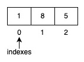

Arrays
======

In this lab, we will be exploring arrays and a few examples of how to use them.

WHAT IS AN ARRAY?
-----------------
An array in Go is simply a sequence of values with the same data type, e.g integers, floats, strings, etc with a fixed size.

CREATING ARRAYS
---------------
There are a few ways of creating arrays within Go. The simplest form is by specifying the array size inside square brackets (e.g. `[5]`) followed by the type that you'd like the sequence to have (https://go.dev/tour/moretypes/6).

For example:
```go
var ages [5]int
```
declares a variable `ages` which contains an array of 5 integers. Because we used the `var` keyword, the elements hold the default value for an `int` (integer) which is `0`. 

Note that the size of this array is fixed to 5 elements and cannot be changed. We will soon show an alternative data structure called a `slice` which **does** have options for changing the size.

You can also initialise an array with values at the same time as declaring it, for example:
```go
var ages = [5]int {1, 8, 5, 2, 10}
```

LAB TASK 1
----------
Let's create a real-life example of an array as a lab task - a shopping list! A shopping list is usually just a simple list of items you need to remember to buy.

For this lab task, create an array of 5 elements that holds the following items: apples, oranges, bread, milk, eggs.

When your program is run, it should output the list of items in the shopping list, like so:
```
[apples oranges bread milk eggs]
```

REFERENCING ITEMS IN AN ARRAY
-----------------------------
Every single item in an array has its own "numerical index" assigned, starting from the number 0. For example, in the following array:

```go
var ages [3]int = {1, 8, 5}
```
the index assigned to the number "1" is "0", because it's the first item in the array.

Here's a visual representation of what this looks like to help you understand it:



To reference a particular item in the array, you can specify it's index inside square brackets, e.g. `[1]`.

For example, to reference the last number in the array above (which is 5), use the following syntax:

```go
ages[2]
```

Remember that array indexes start from 0, hence why the above references the "third" item using an index number of "2".

LAB TASK 2
----------
Write a program that prints out the value of the **third** item in the shopping list array you created in Lab Task 1. 

When your program is run, it should output the following:
```
bread
```
